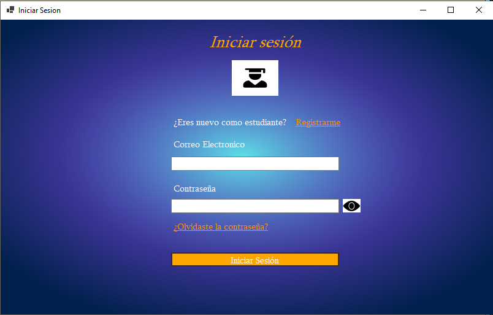
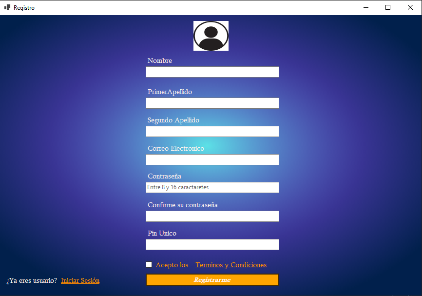
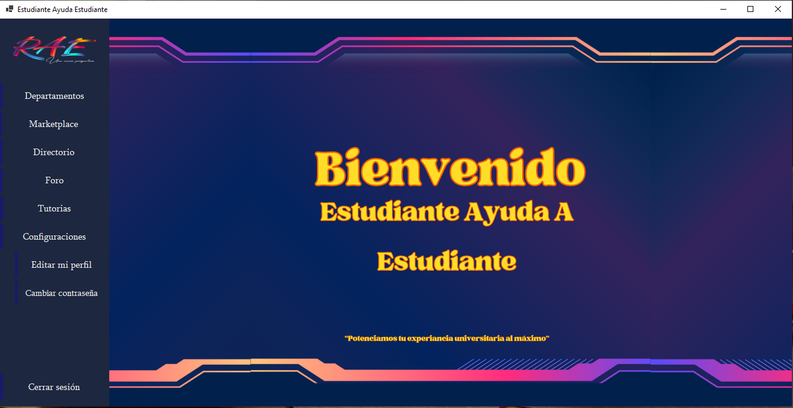

# 🎓 Estudiante Ayuda Estudiante

**Estudiante Ayuda Estudiante** es una aplicación de escritorio desarrollada en **C# (.NET Windows Forms)** que busca conectar a estudiantes entre sí.
Permite publicar y buscar **apartamentos**, **artículos en venta** y participar en un **foro de preguntas y respuestas**.

---

## 🚀 Características principales

* 👤 **Gestión de usuarios**
  Registro, inicio de sesión y autenticación básica por estudiante.

* 🏠 **Publicación de apartamentos**
  Los estudiantes pueden publicar y consultar lugares para alquilar cerca de la universidad.

* 🛒 **Marketplace de artículos**
  Espacio para comprar o vender objetos entre estudiantes (libros, útiles, dispositivos, etc.).

* 💬 **Foro de preguntas y respuestas**
  Sección donde los estudiantes pueden realizar consultas y responder a otros compañeros.

* 🎨 **Interfaz intuitiva**
  Diseñada con **Windows Forms**, buscando simplicidad y facilidad de uso.

---

## 🧱 Tecnologías utilizadas

* **Lenguaje:** C#
* **Framework:** .NET (Windows Forms)
* **IDE:** Visual Studio
* **Base de datos:** SQL server

---

## 📷 App

| Pantalla de login        | Pantalla de registro   |
| ------------------------- | --------------------- |
|  |  |

| Pantalla de inicio                         |
| ----------------------------------- |
|  |

---
